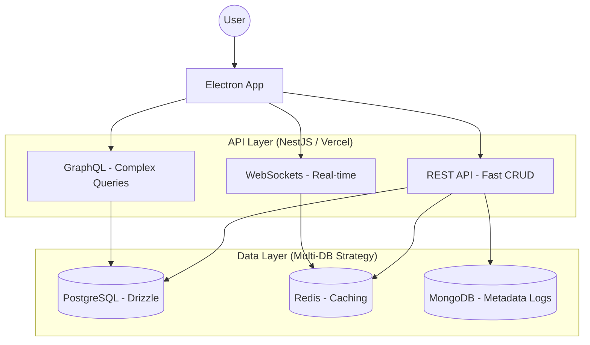

# CaféVerse Optimized Architecture

This document outlines a high-performance, scalable architecture for CaféVerse, focusing on **minimum development cost** while providing paths for advanced optimizations (Multi-API, Multi-DB, and Scaling).

---

## 1. Hybrid System Architecture

To achieve high performance with low dev cost, we utilize a **Multi-Layered** approach.



---

## 2. API Design Strategy (Minimum Cost)

Instead of building everything from scratch, we use multiple API patterns for specific needs:

1.  **REST (NestJS + Swagger):**
    - **Purpose:** Primary CRUD for users and media.
    - **Cost:** Low. Best for standard operations.
2.  **GraphQL (Apollo/Mercurius):**
    - **Purpose:** Powering the "Cinematic Media Pages" where nested data (Media -> Cast -> Similar Movies) is needed in one request.
    - **Cost:** Medium. Prevents over-fetching/under-fetching.
3.  **WebSockets (Socket.io / WS):**
    - **Purpose:** Real-time playback synchronization or live community metrics.
    - **Cost:** Low dev cost if using a managed provider like Pusher or Upstash.

---

## 3. Multi-Database Architecture

We use a "Polyglot Persistence" model where different databases handle what they do best.

| Database Type | Technology | Purpose | Why? |
| :--- | :--- | :--- | :--- |
| **SQL** | PostgreSQL | Source of Truth | Relational integrity for Users, Media, and Watchlists. |
| **NoSQL** | Redis (Upstash) | Cache & Speed | Store "Trending" and "Featured" lists for sub-millisecond response. |
| **NoSQL** | MongoDB | Flexible Metadata | Storing raw, unstructured JSON from TMDB imports without schema migrations. |
| **Graph** | Neo4j (Future) | Recommendations | Mapping relationships between actors and directors for advanced discovery. |

---

## 4. Scaling Strategy

### Vertical Scaling (The "Easy" Way)
- **Dev Cost:** Zero code changes.
- **Implementation:** Increase Vercel function memory/timeout limits. Scale up the PostgreSQL instance (CPU/RAM).

### Horizontal Scaling (The "Pro" Way)
1.  **Serverless Scaling:** Vercel automatically scales horizontally by spawning new instances of your NestJS functions.
2.  **Database Read Replicas:** Connect the "Media Search" and "Read" endpoints to Postgres Read Replicas to offload the primary DB.
3.  **Global Edge Caching:** Use Vercel Edge Functions or Cloudflare Workers to cache API responses geographically close to users.

---

## 5. Minimum Dev Cost Implementation Path

To keep development fast and cheap while hitting these goals:

1.  **Shared Schema (Drizzle):** Use the unified schema (SQL) for 90% of features.
2.  **Redis for Performance:** Wrap heavy queries (like `GET /search`) in a simple Redis cache.
3.  **Managed Infrastructure:**
    - **Supabase/Vercel Postgres:** No DB maintenance.
    - **Upstash Redis:** Serverless Redis with zero config.
    - **Pusher:** For real-time features without managing WebSocket servers.
4.  **Automatic Import Workers:** Use Vercel Cron jobs to trigger TMDB imports at night, keeping the `media` table fresh without manual work.

---

## 6. Advanced Database Schema (Optimized)

We extend the Drizzle schema with **Read-optimized Indexes** and a **Watchlist** junction.

```ts
// ... (Previous schema from section 2)

// Optimization: Add a GIN Index for full-text search on PostgreSQL
// This allows high-performance fuzzy searching across 100k+ records
export const mediaSearchIndex = index('media_search_idx').using(
  'gin',
  sql`(to_tsvector('english', title || ' ' || overview))`
);

// Optimization: User-specific Watchlist with unique constraint
export const watchlist = pgTable('watchlist', {
  id: serial('id').primaryKey(),
  userId: bigint('user_id', { mode: 'bigint' }).references(() => users.id),
  mediaId: integer('media_id').references(() => media.id),
  addedAt: timestamp('added_at').defaultNow(),
}, (t) => [
  uniqueIndex('unique_user_media_watchlist').on(t.userId, t.mediaId),
]);
```
