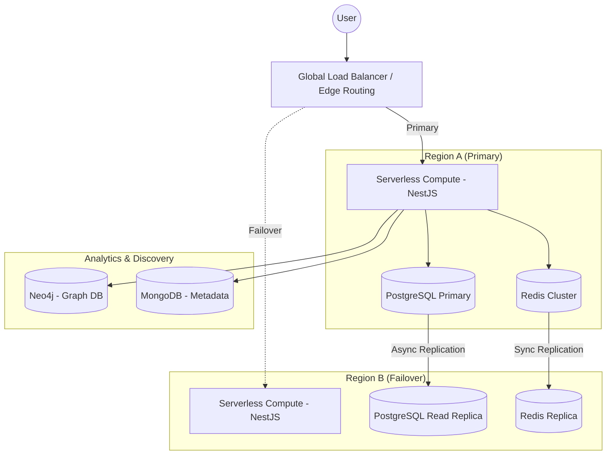

# CaféVerse High-Reliability Architecture

This document defines a high-availability, fault-tolerant system architecture for CaféVerse. The primary focus is **Reliability, Data Integrity, and Observability**, utilizing a multi-paradigm database and API strategy.

---

## 1. High-Availability (HA) Architecture

We move from a single-point-of-failure model to a **Multi-Region / Multi-Zone Redundancy** model.



---

## 2. Reliability Pillars

### I. Data Persistence & Integrity
- **PostgreSQL Multi-AZ:** Use a managed service (e.g., AWS RDS or GCP Cloud SQL) with Multi-AZ deployment for automatic failover.
- **PITR (Point-In-Time Recovery):** Enable 35-day automated backups to ensure data can be restored to any specific second.
- **Strict Schema Enforcement:** Use Drizzle ORM with hard Foreign Key constraints and auditing triggers.

### II. Resiliency Patterns
- **Circuit Breakers:** Implement circuit breakers (e.g., using `opossum`) in the NestJS backend to prevent cascading failures when external APIs (TMDB) are down.
- **Retries with Exponential Backoff:** All client-to-server and server-to-DB calls must use retry logic.
- **Rate Limiting:** Implement strict rate limiting (Redis-backed) to protect the backend from DoS and noisy neighbors.

### III. Observability & Monitoring
- **Distributed Tracing:** Integrate **OpenTelemetry** + **Jaeger/Honeycomb** to trace requests across the Electron client and NestJS services.
- **Structured Logging:** Use **Pino** or **Winston** to export JSON logs to a centralized log management system (e.g., Datadog, ELK).
- **Health Checks:** Implement `/health` and `/ready` endpoints for automated load balancer health management.

---

## 3. Multi-Paradigm Data Layer (High Performance & Scale)

| Layer | Strategy | Purpose |
| :--- | :--- | :--- |
| **SQL** | PostgreSQL (RDS/Cloud SQL) | **Source of Truth:** ACiD compliance, synchronous replication, and automated failover for User and Watchlist data. |
| **Cache (NoSQL)** | Redis Cluster | **Performance:** Multi-node cluster to ensure the cache (Trending/Session data) stays alive even if a node fails. |
| **Document (NoSQL)** | MongoDB | **Flexibility:** Store raw, unstructured JSON metadata from TMDB/IMDB imports to ensure the import worker never fails due to schema mismatch. |
| **Graph** | Neo4j | **Discovery:** Map complex relationships between actors, directors, and genres for a high-reliability recommendation engine. |
| **Object Storage** | AWS S3 / GCS | **Persistence:** Store user-uploaded assets with 99.999999999% durability. |

---

## 4. API Design Strategy

1.  **REST (Primary):** Core CRUD operations and authentication.
2.  **GraphQL (Aggregator):** Single-endpoint for complex media detail pages (Media + Cast + Recommendations).
3.  **WebSockets (Real-time):** Real-time playback synchronization and community activity.

---

## 5. Enterprise-Grade Drizzle Schema

We add auditing and strict constraints to the schema to ensure data reliability.

```ts
import {
  pgTable,
  serial,
  integer,
  varchar,
  text,
  timestamp,
  bigint,
  check,
  primaryKey,
} from 'drizzle-orm/pg-core';
import { sql } from 'drizzle-orm';

// Audit Mixin for all tables
const auditColumns = {
  createdAt: timestamp('created_at').defaultNow().notNull(),
  updatedAt: timestamp('updated_at').defaultNow().notNull(),
  deletedAt: timestamp('deleted_at'), // Soft-delete support for data recovery
};

export const users = pgTable('users', {
  id: bigint('id', { mode: 'bigint' }).primaryKey().generatedAlwaysAsIdentity(),
  email: varchar('email').notNull().unique(),
  googleId: varchar('google_id').unique(),
  ...auditColumns,
}, (table) => [
  check('email_check', sql`email ~* '^[A-Za-z0-9._%+-]+@[A-Za-z0-9.-]+\\.[A-Za-z]{2,}$'`),
]);

export const media = pgTable('media', {
  id: serial('id').primaryKey(),
  tmdbId: integer('tmdb_id').notNull().unique(),
  title: text('title').notNull(),
  status: varchar('status', { length: 50 }).default('active'),
  ...auditColumns,
});

// Watchlist with strict Foreign Keys and Indexing
export const watchlist = pgTable('watchlist', {
  userId: bigint('user_id', { mode: 'bigint' })
    .notNull()
    .references(() => users.id, { onDelete: 'restrict' }),
  mediaId: integer('media_id')
    .notNull()
    .references(() => media.id, { onDelete: 'cascade' }),
  addedAt: timestamp('added_at').defaultNow().notNull(),
}, (t) => [
  primaryKey({ columns: [t.userId, t.mediaId] }),
]);
```
