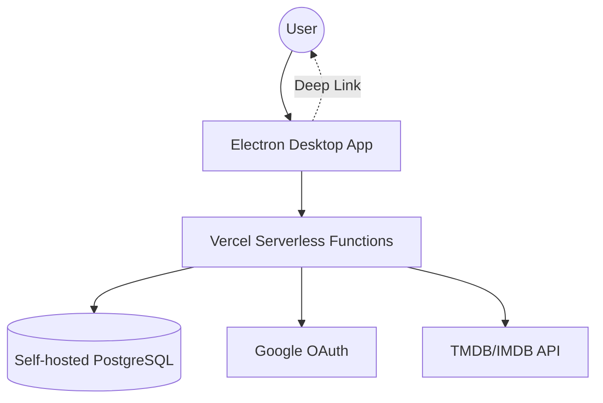

# CaféVerse System Architecture

This document outlines the system design and architecture for CaféVerse as it scales to support 1000+ users with centralized authentication and data synchronization.

## 1. System Overview

CaféVerse is transitioning from a local-only Electron application to a client-server architecture.

- **Frontend:** Electron (React + TypeScript)
- **Backend:** NestJS REST API
- **Database:** Self-hosted PostgreSQL with Drizzle ORM
- **Hosting:** Vercel (Serverless Functions)
- **Authentication:** Google OAuth 2.0

### High-Level Architecture



---

## 2. Database Schema (Drizzle ORM)

The following schema is designed for a normalized, high-performance media database. It includes support for Movies, TV Shows, Seasons, Episodes, and User Watchlists.

```ts
import {
  pgTable,
  serial,
  integer,
  varchar,
  text,
  real,
  bigint,
  timestamp,
  index,
  uniqueIndex,
  primaryKey,
  boolean,
} from 'drizzle-orm/pg-core';
import { sql } from 'drizzle-orm';

// 1. Core Users Table
export const users = pgTable('users', {
  id: bigint('id', { mode: 'bigint' })
    .primaryKey()
    .generatedByDefaultAsIdentity({
      name: 'users_id_seq',
      startWith: 1,
      increment: 1,
    }),
  username: varchar('username').notNull().unique(),
  email: varchar('email').notNull().unique(),
  googleId: varchar('google_id').unique(),
  picture: text('picture'),
  createdAt: timestamp('created_at', { withTimezone: true })
    .notNull()
    .defaultNow(),
  updatedAt: timestamp('updated_at', { withTimezone: true })
    .notNull()
    .defaultNow(),
});

// 2. Normalized Genres Table
export const genres = pgTable('genres', {
  id: serial('id').primaryKey(),
  name: varchar('name', { length: 100 }).notNull().unique(),
});

// 3. Normalized People (Cast & Crew) Table
export const people = pgTable('people', {
  id: serial('id').primaryKey(),
  tmdbId: integer('tmdb_id').unique(),
  name: text('name').notNull(),
  profilePath: text('profile_path'),
});

// 4. Normalized Networks Table
export const networks = pgTable('networks', {
  id: serial('id').primaryKey(),
  name: varchar('name', { length: 255 }).notNull().unique(),
  logoPath: text('logo_path'),
});

// 4.5. Normalized Collections Table
export const collections = pgTable('collections', {
  id: serial('id').primaryKey(),
  tmdbId: integer('tmdb_id').notNull().unique(),
  name: varchar('name', { length: 255 }).notNull(),
  overview: text('overview'),
  posterPath: text('poster_path'),
  backdropPath: text('backdrop_path'),
});

// 5. Unified Media Table
export const media = pgTable(
  'media',
  {
    id: serial('id').primaryKey(),
    tmdbId: integer('tmdb_id').notNull().unique(),
    imdbId: varchar('imdb_id', { length: 20 }),
    title: text('title').notNull(),
    originalTitle: text('original_title'),
    overview: text('overview'),
    releaseDate: varchar('release_date', { length: 10 }),
    posterPath: text('poster_path'),
    backdropPath: text('backdrop_path'),
    voteAverage: real('vote_average'),
    voteCount: integer('vote_count'),
    popularity: real('popularity'),
    status: varchar('status', { length: 50 }),
    contentType: varchar('content_type', { length: 10 }).notNull(),
    createdAt: timestamp('created_at').defaultNow().notNull(),
    tagline: text('tagline'),
    homepage: text('homepage'),
    slug: varchar('slug', { length: 255 }).notNull(),
    collectionId: integer('collection_id').references(() => collections.id, {
      onDelete: 'set null',
    }),
    collectionOrder: integer('collection_order'),
    adult: boolean('adult').default(false).notNull(),

    // Movie-Specific Fields
    runtime: integer('runtime'),
    budget: bigint('budget', { mode: 'bigint' }),
    revenue: bigint('revenue', { mode: 'bigint' }),

    // TV Show-Specific Fields
    numberOfSeasons: integer('number_of_seasons'),
    numberOfEpisodes: integer('number_of_episodes'),
    lastAirDate: varchar('last_air_date', { length: 10 }),

    // Content Classification
    isAnime: boolean('is_anime').default(false).notNull(),
  },
  (table) => [
    index('media_created_at_idx').on(table.createdAt),
    index('media_imdb_id_idx').on(table.imdbId),
    uniqueIndex('media_slug_idx').on(table.slug),
    index('media_collection_id_idx').on(table.collectionId),
    // GIN trigram index for fuzzy title search (requires pg_trgm extension)
    index('media_title_trgm_idx').using(
      'gin',
      sql`${table.title} gin_trgm_ops`,
    ),
  ],
);

// 6. Seasons Table
export const seasons = pgTable(
  'seasons',
  {
    id: serial('id').primaryKey(),
    mediaId: integer('media_id')
      .notNull()
      .references(() => media.id, { onDelete: 'cascade' }),
    seasonNumber: integer('season_number').notNull(),
    episodeCount: integer('episode_count'),
    name: text('name'),
    overview: text('overview'),
    posterPath: text('poster_path'),
    airDate: varchar('air_date', { length: 10 }),
  },
  (table) => [index('seasons_media_id_idx').on(table.mediaId)],
);

// 7. Episodes Table
export const episodes = pgTable(
  'episodes',
  {
    id: serial('id').primaryKey(),
    seasonId: integer('season_id')
      .notNull()
      .references(() => seasons.id, { onDelete: 'cascade' }),
    episodeNumber: integer('episode_number').notNull(),
    name: text('name'),
    overview: text('overview'),
    stillPath: text('still_path'),
    airDate: varchar('air_date', { length: 10 }),
    runtime: integer('runtime'),
    voteAverage: real('vote_average'),
    voteCount: integer('vote_count'),
    tmdbId: integer('tmdb_id').unique(),
  },
  (table) => [
    index('episodes_season_id_idx').on(table.seasonId),
    uniqueIndex('episodes_tmdb_id_idx').on(table.tmdbId),
  ],
);

// 8. User Watchlist Table
export const watchlist = pgTable(
  'watchlist',
  {
    userId: bigint('user_id', { mode: 'bigint' })
      .notNull()
      .references(() => users.id, { onDelete: 'cascade' }),
    mediaId: integer('media_id')
      .notNull()
      .references(() => media.id, { onDelete: 'cascade' }),
    addedAt: timestamp('added_at').defaultNow().notNull(),
  },
  (table) => [
    primaryKey({
      name: 'watchlist_pk',
      columns: [table.userId, table.mediaId],
    }),
    index('watchlist_user_id_idx').on(table.userId),
  ],
);

// ================= Junction Tables =================

// Media <-> Genre
export const mediaGenres = pgTable(
  'media_genres',
  {
    mediaId: integer('media_id')
      .notNull()
      .references(() => media.id, { onDelete: 'cascade' }),
    genreId: integer('genre_id')
      .notNull()
      .references(() => genres.id, { onDelete: 'cascade' }),
  },
  (table) => [
    primaryKey({
      name: 'media_genres_pk',
      columns: [table.mediaId, table.genreId],
    }),
    index('media_genres_genre_id_idx').on(table.genreId),
  ],
);

// Media <-> Cast
export const mediaCast = pgTable(
  'media_cast',
  {
    mediaId: integer('media_id')
      .notNull()
      .references(() => media.id, { onDelete: 'cascade' }),
    personId: integer('person_id')
      .notNull()
      .references(() => people.id, { onDelete: 'cascade' }),
    character: text('character').notNull(),
    order: integer('order'),
  },
  (table) => [
    primaryKey({
      name: 'media_cast_pk',
      columns: [table.mediaId, table.personId, table.character],
    }),
    index('media_cast_person_id_idx').on(table.personId),
  ],
);

// Media <-> Network
export const mediaNetworks = pgTable(
  'media_networks',
  {
    mediaId: integer('media_id')
      .notNull()
      .references(() => media.id, { onDelete: 'cascade' }),
    networkId: integer('network_id')
      .notNull()
      .references(() => networks.id, { onDelete: 'cascade' }),
  },
  (table) => [
    primaryKey({
      name: 'media_networks_pk',
      columns: [table.mediaId, table.networkId],
    }),
    index('media_networks_network_id_idx').on(table.networkId),
  ],
);
```

---

## 3. Google OAuth Flow in Electron

To avoid issues with embedded web views (which Google blocks), CaféVerse uses the **System Browser + Custom Protocol** flow.

1.  **Initiate Login:** The Electron app opens the user's default system browser to the backend auth endpoint: `https://api.cafeverse.com/auth/google`.
2.  **Google Authentication:** The user authenticates with Google in their browser.
3.  **Backend Callback:** Google redirects back to the NestJS backend.
4.  **Token Generation:** The backend generates a JWT for the user.
5.  **Deep Link Redirect:** The backend redirects the browser to a custom protocol: `cafeverse://auth?token={JWT}&user={JSON_STRING}`.
6.  **App Capture:** The Electron app (registered to handle the `cafeverse://` protocol) captures the URL.
7.  **State Update:** The main process sends the token and user data to the renderer process via IPC, updating the `AuthContext`.

---

## 4. API Endpoints (NestJS)

### Auth
- `GET /auth/google` - Redirects to Google OAuth.
- `GET /auth/google/callback` - Handles Google redirect and deep links back to the app.
- `GET /auth/me` - Returns current user profile (JWT required).

### Media
- `GET /media` - Paginated media list with filters.
- `GET /media/:slug` - Detailed media information.
- `POST /media/import` - Triggers import of metadata from TMDB/IMDB by ID.
- `GET /search` - Search media (using Postgres Trigram index).

### Watchlist
- `GET /watchlist` - Returns the authenticated user's watchlist.
- `POST /watchlist` - Adds an item to the watchlist.
- `DELETE /watchlist/:mediaId` - Removes an item from the watchlist.

---

## 5. Infrastructure (Vercel + Self-hosted Postgres)

### Connection Pooling
Vercel's serverless environment creates a new database connection for nearly every request, which can quickly exhaust the `max_connections` on a self-hosted Postgres instance.

**Recommendation:**
- Use **PgBouncer** in front of your PostgreSQL instance.
- Configure Drizzle to connect to the PgBouncer port.
- In `drizzle-orm`, use a connection pooler like `postgres.js` or `pg` with a small `max` connection limit per serverless function instance.

### Scalability for 1000 Users
- **Read Replicas:** Not necessary for 1000 users, but keep in mind for 10k+.
- **Indexing:** Ensure all foreign keys and frequently searched columns (like `title` and `slug`) are indexed.
- **Caching:** Implement a simple in-memory cache (like `lru-cache`) in the NestJS app for frequently accessed media details to reduce database load.

---

## 6. Client-side Architectural Changes

### Centralized State Management
Move away from page-level `useState` for the watchlist.

**Proposal:**
1.  **WatchlistContext / Zustand:** Create a global store to hold the watchlist.
2.  **Sync Logic:**
    - On app launch: Fetch watchlist from `/watchlist` and populate the store.
    - On update: Update the store optimistically and send a request to the API.
    - Fallback: Keep a copy in `localStorage` for offline viewing, but treat the API as the source of truth.

### Custom Protocol Handling
In `main/index.ts`, implement the protocol handler:
```ts
if (process.defaultApp) {
  if (process.argv.length >= 2) {
    app.setAsDefaultProtocolClient('cafeverse', process.execPath, [path.resolve(process.argv[1])])
  }
} else {
  app.setAsDefaultProtocolClient('cafeverse')
}
```
And listen for the `open-url` event (macOS) or check `process.argv` (Windows) to capture the auth token.
